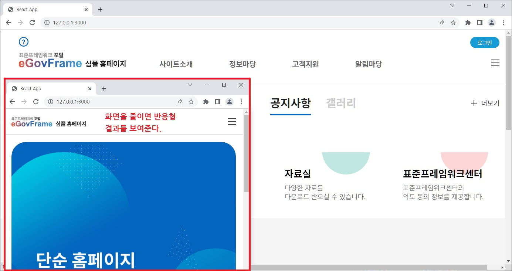

# 전자정부표준프레임워크 심플홈페이지 프런트엔드
- 프런트엔드 원본소스 : https://github.com/eGovFramework/egovframe-template-simple-react
- 개발환경 : 표준프레임워크 4.1.0 ( https://www.egovframe.go.kr/home/sub.do?menuNo=94 )
- 위 개발개발환경에서 설치한 기존 심플홈페이지(참조: https://kimilguk.tistory.com/782)보다 경량이다.
- 장점은 백엔드와 프런트엔드 프로젝트를 분리해서 작업할 수 있다.

- 참고로, 아래는 백엔드 작업소스 입니다.
- https://github.com/kimilguk/egovframe-template-simple-backend

### 2023.04.11(화)
- 프런트엔드 원본 소스를 받아서 개발환경에서 실행 하고, 개인 gitignore 수정 후 깃 저장소에 올려보았다.
- 원본의 .github 폴더는 깃허브에서 workflow를 사용하는 설정이 있기 때문에 지운다.
- 참고로, 이클립스에서 최초 커밋 후 아래 2줄은 해당 프로젝트의 이클립스 터미널에서 실행 해 준다.(다음부턴 할 필요 없다.)
- git branch -M master
- git remote add origin https://github.com/학생의저장소주소.git
- 위 전자정부표준프레임워크 개발환경 외 로컬 PC의 리액트 개발환경 설치

```
1. NVM(노드 버전 매니저) 설치(만약 NVM -v 으로 설치확인이 된다면 이 부분은 넘어간다.)
- nvm-setup.zip 다운로드 https://github.com/coreybutler/nvm-windows/releases
- 압축해제 : 압축을 풀면 nvm-setup.exe 파일이 나온다. 이 파일을 실행시키면 nvm이 설치된다.
- nvm-setup.exe 실행 : 설치 시에 Program File와 같이 띄어쓰기가 있는 경로로 지정하지 말아야한다.
- nvm 버전 확인 : nvm -v
2. Node 버전 설치 프로젝트에서 사용된 환경 프로그램 정보는 다음과 같다.
- 원본 버전: Node.js	v18.12.0
- 원본 버전: NPM	v8.19.2
- 다음 명령어를 통해 18.12.0 버전으로 설치해주었다.
- nvm install v18.12.0
- nvm에서 특정 Node 버전 활성화
- nvm use 18.12.0
- 이렇게 nvm으로 node 버전을 설치하고 활성화까지 해준다.
- node 버전 확인 : node -v
- node가 설치되면서 npm도 자동으로 설치된다. 
- npm 버전 확인 : npm -v
3. 최초 리액트 앱 실행
- 리액트 작업 폴더로 이동한다.(이클립스에서 프로젝트 선택 후 Show in -> Termenal 실행하면 자동으로 이동된다.)
- npm install 로 앱 실행시 필요한 기존에 package.json 에서 지정된 node_modules 를 다운받는다.
- npm start 로 실행한다. 끝
```

# 표준프레임워크 심플홈페이지 FrontEnd


  


※ 본 프로젝트는 기존 JSP 뷰 방식에서 벗어나 BackEnd와 FrontEnd를 분리하기 위한 예시 파일로 참고만 하시길 바랍니다.

## 프로젝트 소개

### 프로젝트 개요

단순 홈페이지 기능 구현 시 필수적인 부분만 사용 가능하도록 경량화 된 실행환경 제공  
메인 페이지, 사용자 관리, 공지사항 관리, 게시판 관리, 안내 관리 기능을 제공

### 메뉴 구성


## 참고 화면 및 메뉴 설명

### 메인 화면


1. 홈페이지 템플릿은 관리자만 로긴 가능하다는 전제로 구성되었으며 최초 관리자 계정 설정은 **[ 로그인계정 : admin , 로그인암호 : 1 ]** 로 설정되어 있다.
2. 관리자 추가 및 변경 기능은 추가 구성되어 있지 않으므로 필요 시 DB를 통해 직접 변경한다. (암호 셋팅 값은 공통컴포넌트의 암호화 로직에 따라 생성해야 함)
3. 기본 기능이나 예시 메뉴를 실무적으로 추가 커스터마이징하여 활용할 수 있다.

### 사이트 소개 화면


- **해당 화면 및 세부 메뉴 화면은 구성을 위한 샘플페이지가 제공되며 기능은 구현되지 않은 상태입니다.**

1. 세부메뉴 : 사이트소개, 연혁, 조직소개, 찾아오시는 길
2. 기능설명 : 예시 메뉴에 해당하는 항목으로 샘플 페이지 형태로 링크와 JSP파일이 존재한다.
3. 활용방법 : 각 샘플 페이지에 대한 콘텐츠를 새로 구성하여 활용할 수 있다.

### 정보마당 화면


- **해당 화면 및 세부 메뉴 화면은 구성을 위한 샘플페이지가 제공되며 기능은 구현되지 않은 상태입니다.**

1. 세부메뉴 : 주요사업 소개, 대표서비스 소개
2. 기능설명 : 예시 메뉴에 해당하는 항목으로 샘플 페이지 형태로 존재한다.
3. 활용방법 : 각 샘플 페이지에 대한 콘텐츠를 새로 구성하여 활용할 수 있다.

### 고객지원 화면


- **해당 화면 및 세부 메뉴 화면은 구성을 위한 샘플페이지가 제공되며 기능은 구현되지 않은 상태입니다.**

1. 세부메뉴 : 자료실, 묻고답하기, 서비스신청
2. 기능설명 : 예시 메뉴에 해당하는 항목으로 샘플 페이지 형태로 존재한다.
3. 활용방법 : 각 샘플 페이지에 기능을 추가 개발 후 구성하여 활용할 수 있다.

### 알림마당 화면


1. 세부메뉴 : 오늘의행사, 금주의행사, 공지사항, 사이트갤러리
2. 기능설명 : 공통컴포넌트 일정관리(부서일정)와 게시판 기능을 커스터마이징하여 사용한다.
3. 활용방법 : 관리자가 등록한 일정정보를 조회하거나 게시물을 조회할 수 있다.

### 사이트관리 화면


1. 세부메뉴 : 일정관리, 게시판생성관리, 게시판사용관리, 공지사항관리, 사이트갤러리관리
2. 기능설명 : 공통컴포넌트 일정관리(부서일정)과 게시판 기능을 커스터마이징하여 사용한다.
3. 활용방법 : 관리자로 로그인 한 후 일정정보를 등록하거나 게시물을 등록할 수 있다. (게시판 설정 가능)

## 환경 설정

프로젝트에서 사용된 환경 프로그램 정보는 다음과 같다.

| 프로그램 명 | 버전 명  |
| :---------- | :------- |
| Node.js     | v18.12.0 |
| NPM         | v8.19.2  |

## BackEnd 구동

[심플 홈페이지 Backend](https://github.com/eGovFramework/egovframe-template-simple-backend.git) 소스를 받아 구동한다.

## FrontEnd 구동

아래 1 ~ 3의 과정을 따라서 진행한다.

### 1. 프로젝트의 생성

Git에서 복제하여 설치 시 1-1. 을 참고한다.

#### 1-1. Git에서 프로젝트 복제 및 모듈 설치

Git에서 clone 한다.

```bash
# 프로젝트 저장소를 로컬로 복제
git clone https://github.com/hmmhmmhm/egovframe-template-simple-react.git

# 복제된 프로젝트 디렉토리로 이동
cd egovframe-template-simple-react

# node modules를 설치해 준다.
npm install
```

### 2. 백엔드 프로젝트 설정

구동된 BackEnd 서버의 URL을 본 어플리케이션의 .env.development 파일의 REACT_APP_EGOV_CONTEXT_URL에 설정해 준다.
(단, 개발환경에서는 사용하는 환경변수 정보는 .env.development, build 시 사용하는 환경변수는 .env.production 에 기입해 준다.)

```bash
# .env.development 예시
REACT_APP_EGOV_CONTEXT_URL=localhost:8080
```

### 3. 프로젝트 실행 및 기타 명령어

```bash
# 테스트용 리액트 서버를 실행할 때 아래 명령어를 사용한다.
npm start
```

---

### 참조

보다 상세한 설명은 아래의 문서를 확인한다.

1. [Available scripts in CRA](./Docs/create-react-app-script.md)
2. [개발환경 초기 설정](./Docs/development-env-setting.md)
